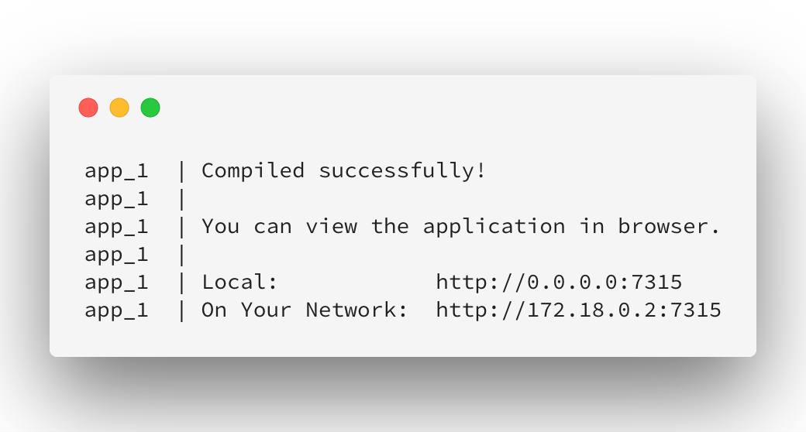
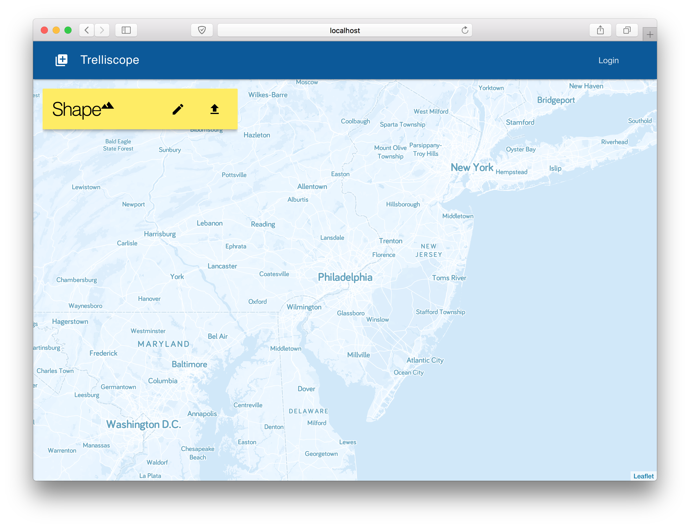
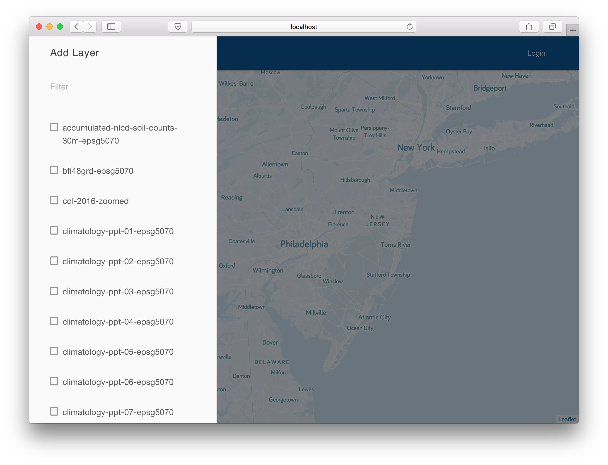
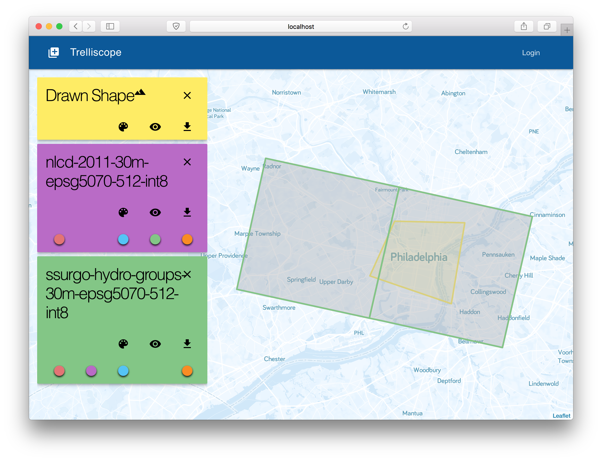
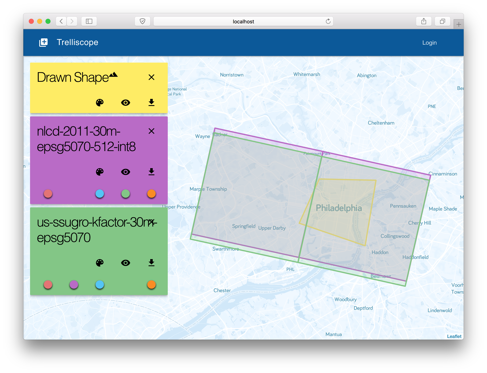
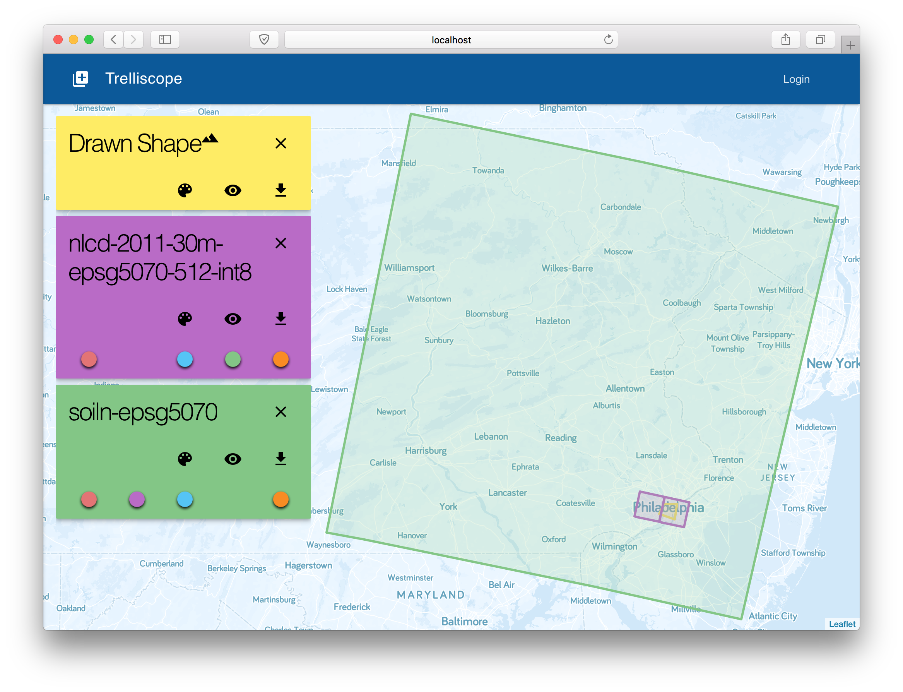
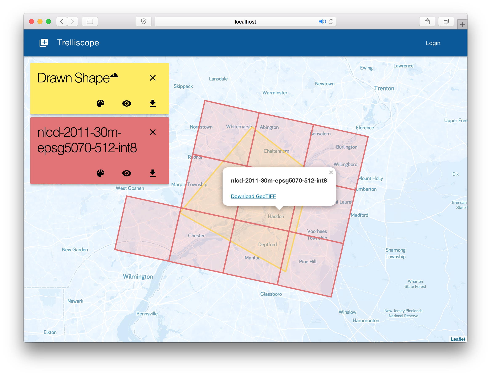

# Trelliscope

Trelliscope is a tool to inspect and verify geospatial RDD layers that have been ingested into [Amazon S3](https://aws.amazon.com/s3/) via [GeoTrellis](https://geotrellis.io/). It presents a simple interface which, given AWS credentials and an S3 bucket with ingested data, allows you to draw a shape on the map and select layers to overlay. This allows verifying alignment of layers after an ingest.


## Installation

Trelliscope requires [Docker](https://www.docker.com/). With that installed, clone this repository, and then run the `update` script to install dependencies, and `server` to run the app:

```bash
$ git clone https://github.com/rajadain/trelliscope.git
$ cd trelliscope/
$ ./scripts/update
```

## Usage

### Running the App

To run the app, do:

```bash
$ cd trelliscope/
$ ./scripts/server
```

The server will be up and running when you see this screen:



Then go to [http://localhost:7315/](http://localhost:7315/) to see the app.

### Specifying Credentials


Specify your S3 Bucket in the first screen, optionally providing AWS credentials. Otherwise it will use the default credentials specified in your `~/.aws/credentials`. You may specify an S3 bucket, or a path leading to a subfolder. The S3 path must contain an `_attributes/` folder containing metadata for the ingested layers. When ready, click "GO".

### Adding a Shape



You will then see a map, with a floating "Shape" card. This has two options: :pencil2: Drawing a shape, or :arrow_up: Upload a shape. Uploading accepts GeoJSON files. Add a shape using one of the options.

The shape card also allows you to set the visibility of the shape, select its color, and download it as a GeoJSON. Clicking the :heavy_multiplication_x: X in the corner will clear the shape and any loaded layers.

### Adding Layers



Next, click the :heavy_plus_sign: Plus Icon in the top left to open the layer selection sidebar. Use the search at the top to filter layers, and check any layer to add it to the map. This will fetch the tiles intersecting the shape from S3.

Each layer card allows you to toggle its visibility,select its color, and download it as a GeoJSON. Clicking the :heavy_multiplication_x: in the corner will remove that layer.

### Checking for Alignment

When two perfectly aligned layers are added to the map, they will overlay each other exactly:



When they are not perfectly aligned, it will be easily observable:



You can also observe how different tiles can be for different layers, based on how they were ingested:



### Downloading Tile GeoTIFF

By clicking on a tile, you can download its GeoTIFF:



## Development

Trelliscope has two main components: the front-end and the back-end. The front-end is written in [Preact](https://preactjs.com/) and [Redux](https://redux.js.org/), with UI components from the [Preact Material Design Lite](https://github.com/developit/preact-mdl) library, mapping software via [Leaflet](http://leafletjs.com/), basemaps via [MapBox](https://www.mapbox.com/), and stock imagery via [Unsplash](https://unsplash.com/). The back-end is written in Scala using [Akka Http](https://doc.akka.io/docs/akka-http/current/index.html?language=scala) for HTTP access, and [GeoTrellis](https://geotrellis.io/) for layer querying and tile generation.

`./scripts/server` runs both the front- and back-ends with live reloading, so any changes made to the code is immediately compiled and served to the browser.

The front-end code is under `./app/src/`, and is organized into `assets` which contains static assets like images, `components` which has various Preact components, `redux` which houses actions and reducers, as well as some utilities, `routes` which has the Redux-aware parent components for each route, and `style` which contains SASS files.

The entry point is `index.js` which loads dependencies and the primary component `components/App.js`, which sets up everything else.

The back-end code lives under `./api/src/`, with `WebServer.scala` being the main entry point. The various `S3*.scala` files override GeoTrellis classes to allow custom AWS credentials at run time, and `Utils.scala` contains minor utilities.

The back-end server is directly accessible at [http://localhost:7316/](http://localhost:7316/) for debugging purposes.

## Contibuting

You can contribute by [adding an issue](https://github.com/rajadain/trelliscope/issues). Please contact me before spending time on adding any code changes so we can coordinate on direction.

## Acknowledgments

I'd like to thank [Azavea](https://www.azavea.com/) for giving me the skills and space to work on this, and for contributing time for me to enhance this project.

This project would not be possible without the many commercial and open source projects and services it is built upon. Here are just a few:

  * [GeoTrellis](https://geotrellis.io/)
  * [Docker](https://www.docker.com/)
  * [Yarn](https://yarnpkg.com/)
  * [Preact](https://preactjs.com/)
  * [Redux](https://redux.js.org/)
  * [Material Design Lite](https://getmdl.io/)
  * [Material.io](https://material.io/)
  * [Preact MDL Library](https://github.com/developit/preact-mdl)
  * [Leaflet](http://leafletjs.com/)
  * [MapBox](https://www.mapbox.com/)
  * [Unsplash](https://unsplash.com/)
  * [Scala](https://www.scala-lang.org/)
  * [SBT](https://www.scala-sbt.org/)
  * [Akka Http](https://doc.akka.io/docs/akka-http/current/index.html?language=scala)
  * [Visual Studio Code](https://code.visualstudio.com/)
  * [IntelliJ IDEA](https://www.jetbrains.com/idea/)
  * [iTerm 3](https://www.iterm2.com/version3.html)
  * [Carbon](https://carbon.now.sh/)
  * [Gifox](https://gifox.io/)
